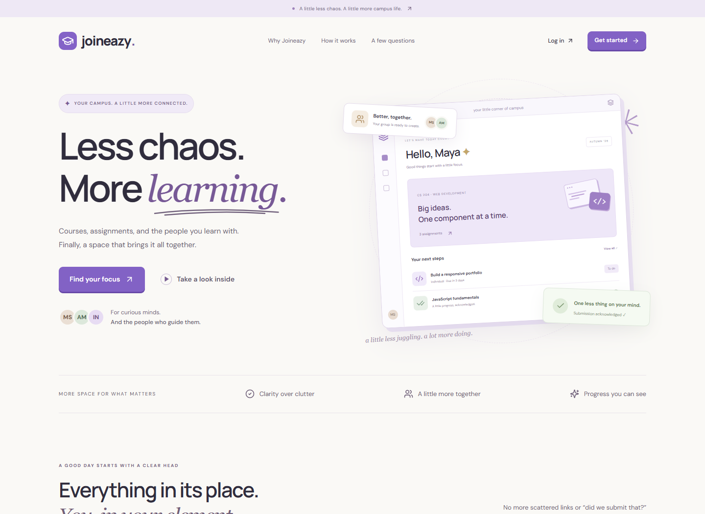
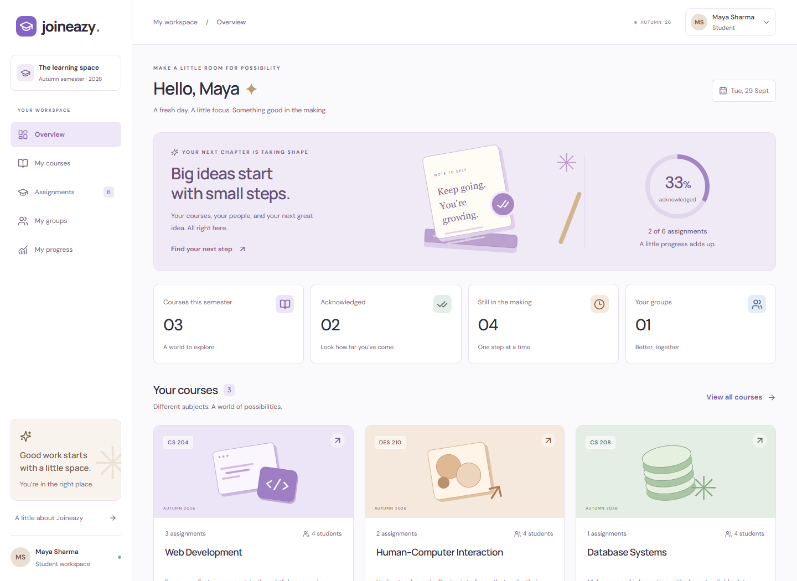
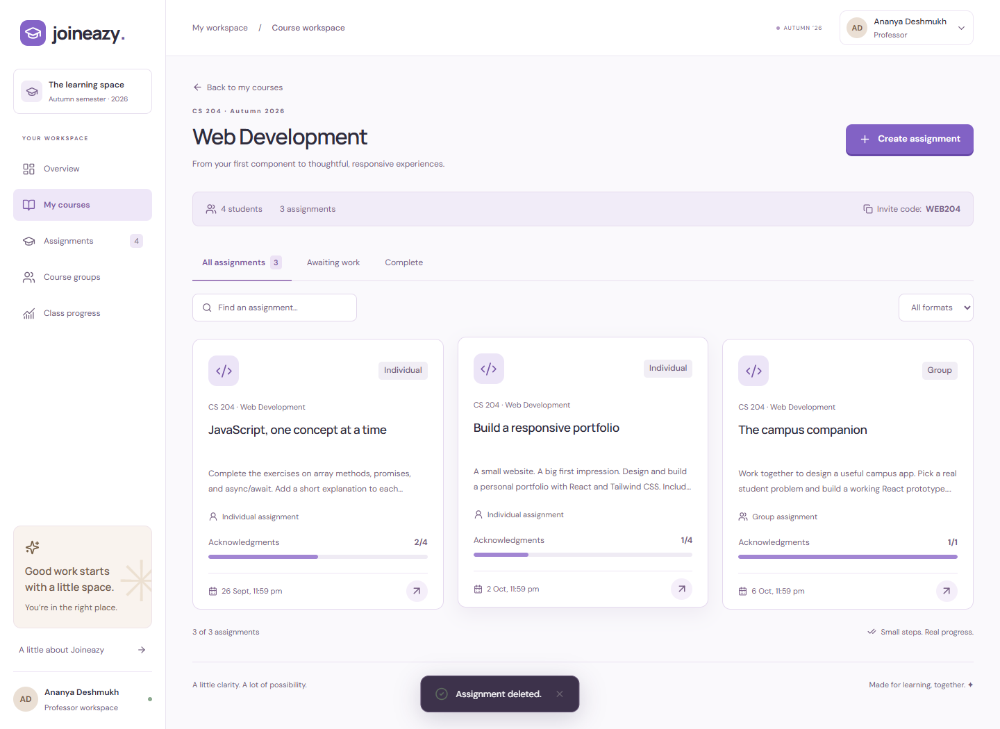
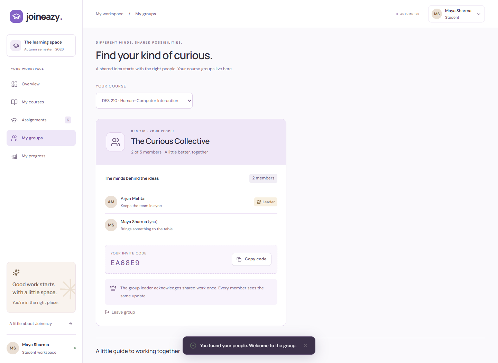
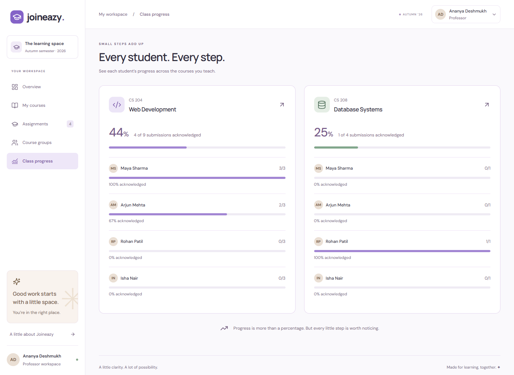
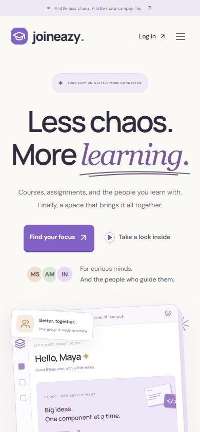
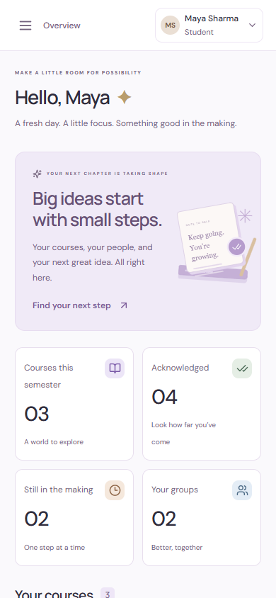
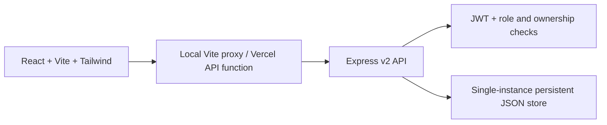

# Joineazy · Learning, together

A responsive assignment workspace for students and professors, built for **Frontend Task 2** with React, Vite, Tailwind CSS, and an ES-module Node/Express API.



## Run locally

Use Node.js **22.12+** and npm. From the repository root:

```sh
npm ci
npm run dev
```

Open **http://localhost:5173**. The API runs on port **3001**; Vite proxies `/api` to it. No external account or database is needed for local evaluation. The first launch seeds the workspace; subsequent launches preserve it in ignored `backend/storage/` files.

For a local production preview:

```sh
npm run build
npm start
```

Open **http://localhost:3001**. Do not set `COOKIE_SECURE=true` for an HTTP local preview. Environment examples describe deployment values; they are not automatically loaded by the local start script.

## Try both roles

The login page has **Student demo** and **Professor demo** buttons. Demo accounts can switch profiles using the custom account menu in the top right. Registered accounts use normal sign-in and sign-out.

All seeded demo accounts use password **`LearnTogether26!`**.

| Account         | Email                    | What to try                                     |
| --------------- | ------------------------ | ----------------------------------------------- |
| Maya Sharma     | maya@demo.joineazy.app   | Student; Pixel Pioneers group leader            |
| Arjun Mehta     | arjun@demo.joineazy.app  | Student; same group, without leader permissions |
| Rohan Patil     | rohan@demo.joineazy.app  | Student; Query Crew leader                      |
| Isha Nair       | isha@demo.joineazy.app   | Student; Query Crew member                      |
| Ananya Deshmukh | ananya@demo.joineazy.app | Professor; Web Development and Database Systems |
| Vikram Rao      | vikram@demo.joineazy.app | Professor; Human–Computer Interaction           |

New registrations start with an empty workspace. Students can enroll with **WEB204**, **DES210**, or **DATA208**. Professors can create a course and share its generated invite code.

## What is implemented

- JWT login and registration with validated forms, role-specific redirects, password hashing, and HTTP-only session cookies.
- Student semester courses and professor-owned course dashboards.
- Assignment creation, reading, editing, and deletion, with title, brief, exact deadline, OneDrive link, and individual/group format.
- Two-step acknowledgment with a server timestamp. Repeated requests preserve the original timestamp.
- Course-specific groups, invite codes, and leader-only group acknowledgment. All members see the same result and timestamp.
- A clear create/join prompt for students without a group; group membership locks after acknowledgment to preserve its meaning.
- Course and class progress, submitted counts, search and status/type filters, empty states, errors, feedback toasts, and confirmation dialogs.
- An original landing page, locally bundled typography, custom artwork, mobile navigation, keyboard-accessible dialogs, and a styled account menu.

The server enforces course ownership, enrollment, and group leadership; hiding a button is not the authorization boundary. Students receive only their own acknowledgment records. The active app refreshes on focus and periodically while visible so shared progress updates appear.

OneDrive submissions happen outside Joineazy. This app records acknowledgment; it does **not** upload or inspect OneDrive files. Seed assignments deliberately have no invented submission links. A professor can add a real OneDrive or SharePoint link in the assignment form.

## Screenshots

| Student dashboard                                            | Professor assignments                                                |
| ------------------------------------------------------------ | -------------------------------------------------------------------- |
|  |  |

| Course groups                          | Class progress                                         |
| -------------------------------------- | ------------------------------------------------------ |
|  |  |

| Mobile landing                                         | Mobile workspace                                         |
| ------------------------------------------------------ | -------------------------------------------------------- |
|  |  |

## Project structure

```text
frontend/
  src/round2/
    components/       Shared UI, dialogs, navigation, layout
    context/          Session and workspace state
    features/         Assignment forms/details and course actions
    lib/              API client and display helpers
    pages/            Landing, auth, dashboards, courses, groups, progress
    App.jsx           Routing and role guards
    styles.css        Tailwind integration and visual system
backend/
  src/v2/
    router.js         Auth and resource endpoints
    domain.js         Validation, access rules, scoped read models
    security.js       Password hashing and JWT cookies
    seed.js           Indian demo identities and course data
  src/services/store.js  Serialized, atomic JSON persistence
  tests/              API and authorization tests
api/[...path].js       Vercel same-origin API proxy
scripts/record-demo.mjs  Reproducible video walkthrough
 tests/               Browser/accessibility and proxy checks
 docs/                Deployment guide, walkthrough, screenshots
```

Task 1 source remains for reference and regression tests; it is not mounted by the frontend entry point. Its original documentation is in [docs/task1-reference.md](docs/task1-reference.md). Task 2 uses `/api/v2` and its own data file.



## Validation

```sh
npm run check         # ESLint, backend tests, production build
npm run test:proxy    # Vercel proxy behavior
npx playwright install chromium
npm run test:e2e      # Real browser workflows and axe accessibility checks
npm run record:demo   # Generates output/demo/joineazy-round2.webm
```

On Windows with Edge already installed, `$env:PLAYWRIGHT_CHANNEL='msedge'` can select it for browser scripts. Video recording also requires Playwright's ffmpeg (`npx playwright install ffmpeg`).

The browser suite uses a disposable server and data store. It covers sign-in, invalid credentials, registration, enrollment, role redirects, individual acknowledgment, group-leader restrictions, shared timestamps, group creation/joining, professor CRUD, and class progress. It checks horizontal overflow at 320px, 390px, and 768px and runs WCAG A/AA axe checks on representative screens. Automated accessibility checks complement, rather than replace, manual keyboard and screen-reader testing.

## Deployment and submission

The chosen architecture is **Vercel frontend + hosted Node backend**, with a same-origin API proxy for cookies. Follow [the deployment guide](docs/DEPLOYMENT.md). A live deployment URL must be created in your hosting account; no live URL is claimed by this repository.

See [the demo walkthrough and submission checklist](docs/DEMO-WALKTHROUGH.md) and [the requirement mapping](docs/REQUIREMENTS.md). Both assignment PDFs are excluded from Git. The submission form remains for the applicant to complete.

## Design decisions and limits

Warm ivory, lavender, mint, and peach organize a calm learning workspace. DM Sans and Manrope are bundled locally. Shared cards, badges, dialogs, focus states, and responsive layouts keep both roles consistent; CSS artwork avoids external image dependencies.

This is a working internship MVP. JSON persistence is suitable for **one Node process with a persistent disk**, not multiple instances or serverless backend storage. A production rollout would use a transactional database, verified faculty provisioning, password reset/email verification, distributed rate limiting, and session revocation. Role choice during registration and public demo accounts are intentional evaluation features. JWTs expire after eight hours; sign-out clears the browser cookie. Demo data is shared on a deployed instance, so reviewers can affect one another's workspace.
